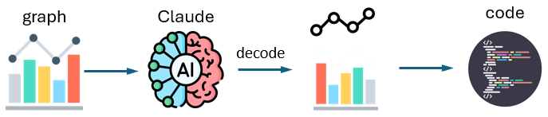

# What does AI understand about a graph?

<!-- badges: start -->
<!-- badges: end -->

{width=70% height=70%}

How much does AI know about understanding and producing graphs?
This article describes an experiment where I give a graph to
Claude Haiku and ask the following questions:

* Can AI correctly interpret the information that is shown in graphs of different types?
* Does it understand the variety of types of charts and the uses in communication for which they are well-suited or fail?
* Given the image a graph and the data, how well can AI reconstruct the graph using software?
* Can it take one attempt at creating a graph, accept criticism, and produce something better able to answer a given design goal?

